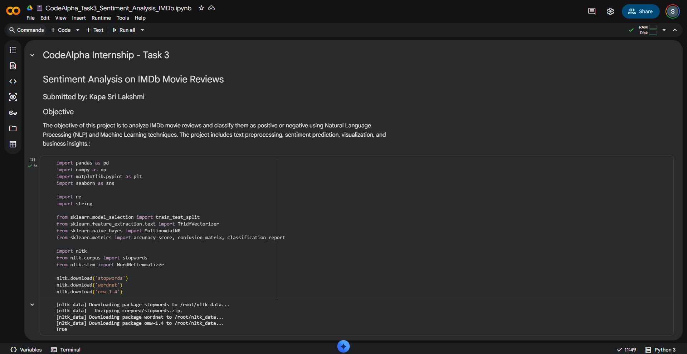
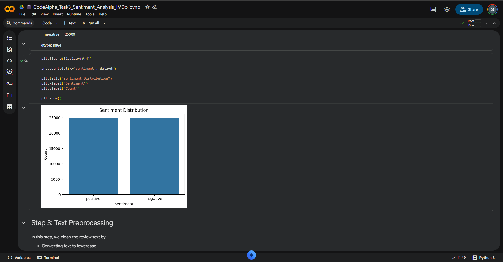
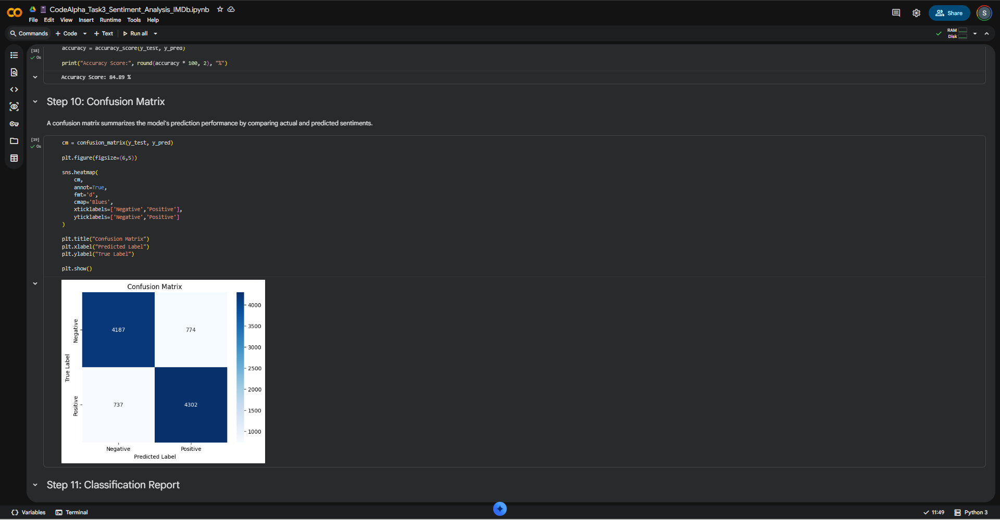
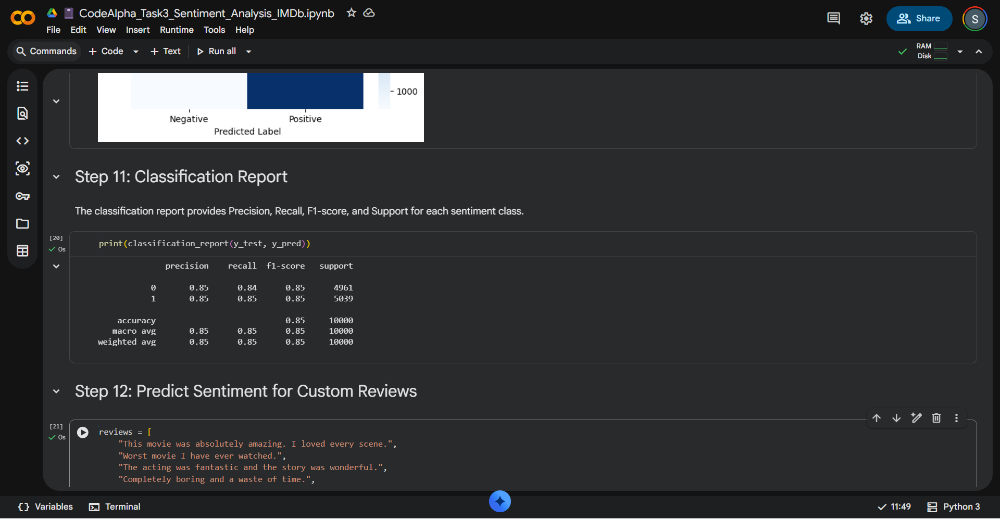
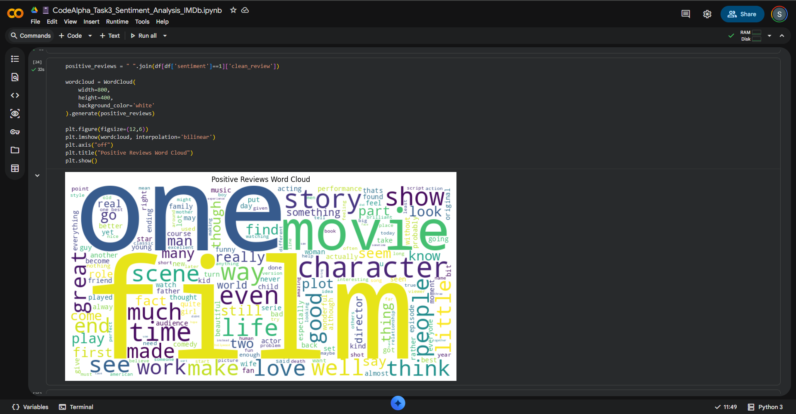
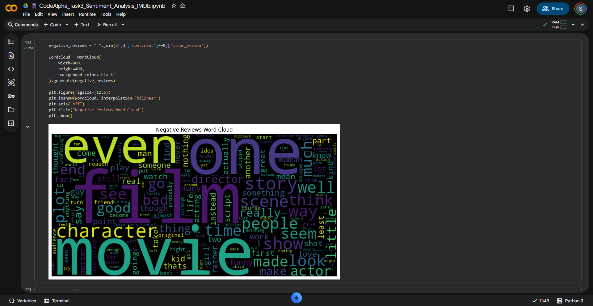
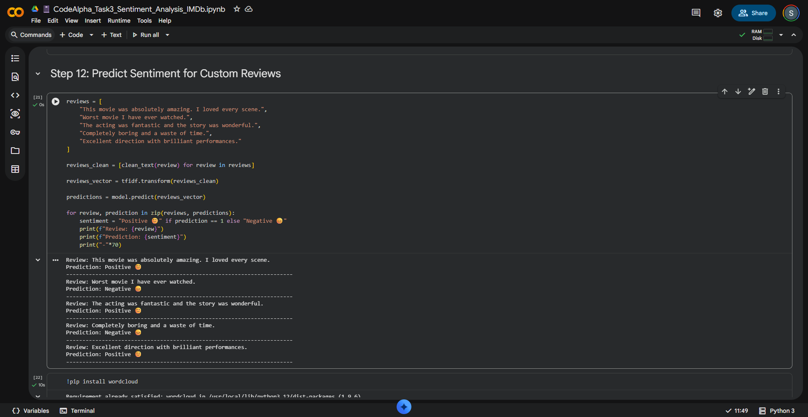

# 🎬 CodeAlpha Task 4: Sentiment Analysis on IMDb Movie Reviews

## 📌 Project Overview

This project was completed as part of the **CodeAlpha Data Analytics Internship**.

The objective is to analyze IMDb movie reviews and classify them into **Positive** or **Negative** sentiments using **Natural Language Processing (NLP)** and **Machine Learning** techniques.

The project includes text preprocessing, feature extraction, model training, evaluation, and visualization to understand sentiment patterns.

---

## 🎯 Objectives

- Analyze movie review text data.
- Perform text preprocessing using NLP.
- Convert text into numerical features using TF-IDF.
- Train a Machine Learning model for sentiment classification.
- Evaluate model performance using various metrics.
- Visualize sentiment distribution and frequently used words.
- Generate business insights from sentiment patterns.

---

## 📂 Dataset

**Dataset:** IMDb Movie Reviews Dataset (50,000 Reviews)

- 50,000 Movie Reviews
- Balanced Dataset
- 25,000 Positive Reviews
- 25,000 Negative Reviews

---

## 🛠 Technologies Used

- Python
- Pandas
- NumPy
- Matplotlib
- Seaborn
- NLTK
- Scikit-learn
- WordCloud
- TextBlob
- Google Colab

---

## 📊 Project Workflow

1. Import Libraries
2. Load Dataset
3. Data Exploration
4. Text Preprocessing
5. TF-IDF Feature Extraction
6. Train-Test Split
7. Model Training (Multinomial Naive Bayes)
8. Sentiment Prediction
9. Model Evaluation
10. Word Cloud Visualization
11. Business Insights

---

## 📈 Model Performance

| Metric | Value |
|---------|--------|
| Algorithm | Multinomial Naive Bayes |
| Accuracy | **84.89%** |
| Feature Extraction | TF-IDF |
| Dataset Size | 50,000 Reviews |

---

# 📸 Project Screenshots

## Dataset Preview



---

## Sentiment Distribution



---

## Confusion Matrix



---

## Classification Report



---

## Positive Reviews Word Cloud



---

## Negative Reviews Word Cloud



---

## Custom Predictions



---

# 💡 Business Insights

- The dataset contains an equal number of positive and negative reviews, resulting in balanced model training.
- The Naive Bayes classifier achieved an accuracy of **84.89%**.
- Positive reviews frequently contain words such as **love**, **great**, **excellent**, and **best**.
- Negative reviews commonly include **bad**, **worst**, **boring**, and **waste**.
- Sentiment analysis helps organizations understand customer opinions, improve products, monitor public feedback, and support better business decisions.

---

# 🚀 Future Improvements

- Implement Deep Learning models such as LSTM or BERT.
- Add multiclass sentiment classification (Positive, Neutral, Negative).
- Perform real-time sentiment analysis on social media data.
- Build an interactive web application using Streamlit.

---

# 📦 Installation

```bash
pip install -r requirements.txt
```

---

# ▶️ Run the Project

Open the notebook in **Google Colab** or **Jupyter Notebook** and execute all cells sequentially.

---

# 👩‍💻 Author

**Kapa Sri Lakshmi**

B.Tech - Computer Science and Engineering

Data Analytics Enthusiast

GitHub: https://github.com/kapasrilakshmi075

LinkedIn: https://www.linkedin.com/in/kapa-srilakshmi-4a0602354/

---

## ⭐ If you found this project useful, consider giving it a Star!
